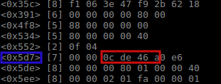
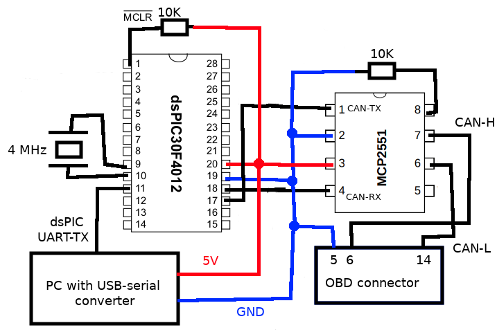

# car-reminder

Car maintenance reminder with CAN interface for Renault Megane 3 (2010)

# Why

I easily forget about the regular car maintenance, like oil and filter changes which should be done every ~10000 km.

Newer cars have a reminder system for when to do this maintainance work. My Renault Megane 3 from 2010 had a notifier for the 30000km/2 years maintenance. But it didn’t had one for the oil and filter changes, which happen more often.

So I decided to build such a maintenance reminder myself.

# How

First thing: read the car's travelled distance aka the odometer. From where? CAN bus of course.

Where do you find the CAN bus? On the OBD connector.

In order to read the travelled distance info, I needed to dump the CAN messages from my car and find out which of the messages contained the needed information.

To dump the CAN messages from my car I used the BananaPi-M1+ board (http://www.banana-pi.org/m1plus.html).
The reason for choosing this board was that it uses the Allwinner A20 SoC, which has an integrated CAN controller. To connect to the car’s CAN interface, only a CAN transceiver chip was needed. I used Microchip’s MCP2551 part for this purpose.

I used the `candump` Linux utility to dump the CAN messages and search for the odometer information. I made an educated guess that the bit rate of the CAN bus would be 500Kb/s or 1Mb/s.
After setting it to 500Kb/s the messages started pouring. Searching for the odometer information
that I needed in the plethora of dumped bytes wasn’t very successful.

Luckily, I was able to find on the Internet the work of a guy that decoded the CAN messages for the Renault Fluence ZE electric vehicle:
https://docs.google.com/spreadsheets/d/1p_zEgy8RqvTV79mT4HFdyKinz3l3q-WlECp_W2ymePM/edit#gid=700456069

Even though the messages don’t match too much between my car and his, the odometer information was at the same CAN ID and byte position.

The odometer CAN message has the CAN ID 0x5d7 and is represented in hexadecimal as number of km*100 in the bytes marked in the red square. In this case 0xcde46a = 13493354 which divided by 100 gives us 134933 km traveled by the car.

Now that I know from where to read the odomoter information let's design the reminder.

# The maintenance reminder

Design goals:

* uses microcontroller because of small form factor and low price

* visual information about distance left until maintenance

* audio warning when maintenance time is close

* user button to reset the maintenance reminder at current travelled distance

I used Microchip's dsPIC30F4012 MCU because it has an internal CAN controller and I had it on hand.

I got this project at ~85% progress but unfortunatelly it abruptly stopped when the car was involved in a crash that made it KO. The insurance company said that it was too expensive to repair.

One good part is that when the accident happened the most complex and interesting part of the project was already implemented.

The project is able to read the odomoter information from the CAN bus. I set the CAN interface in receive mode with a 500KHz baud rate and set a receive filter for the odomoter message CAN ID(0x5d7).

When the user button is pressed for >3s, the odometer data is written in MCU's internal EEPROM and the maintenance countdown starts.

Every time the system starts, it will read the distance stored in EEPROM. Then it subtracts the stored distance from the current odometer reading.

The system prints over UART for debugging purposes the distance stored in memory, the current travelled distance and the distance delta.

My idea was to light up a LED for each 1000 Km travelled, to provide visual feedback. When the travelled distance excedeed 9000Km I planned to ring a buzzer for 2 seconds at every system start. When the user would have done maintenance, it would long press the user button to start a new cycle. This visual and audio part of the project was not tested even though it was almost fully coded.

So the project does what it needs to do, but with debug messages over UART instead of the visual and audio aids that were planned.

It's very possible that this project could work on other Renault car models as well, since reuse of CAN messages library is a common thing.

Project was compiled in MPLAB-X with XC-16 compiler.

# Schematic in GhettoCAD

